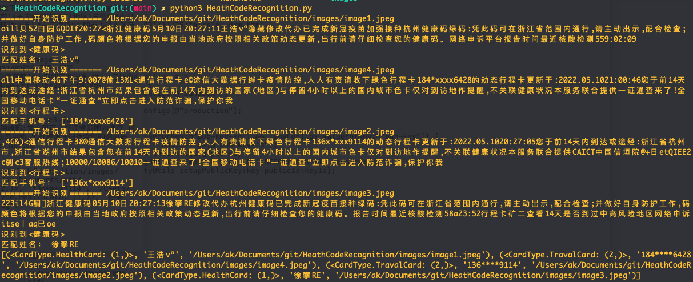

# HeathCodeRecognition
健康码、行程码识别.
利用Python3中PIL、pytesseract插件提供的OCR能力，将健康码、行程码图片转文字信息。

## 准备环境

安装：
pip3 install Pillow
pip3 install pytesseract

查看本地版本：
➜  HeathCodeRecognition git:(main) ✗ pip3 list | grep 'pytesseract'
pytesseract               0.3.9
➜  HeathCodeRecognition git:(main) ✗ pip3 list | grep 'Pillow'
Pillow                    9.1.0

## 测试结果

 

➜  HeathCodeRecognition git:(main) ✗ python3 HeathCodeRecognition.py
=======开始识别======= /Users/ak/Documents/git/HeathCodeRecognition/images/image1.jpeg
oill贝52曰园GQDIf20:27<浙江健康码5月10日20:27:11王浩v“隐藏修改代办已完成新冠疫苗加强接种杭州健康码绿码:凭此码可在浙江省范围内通行,请主动出示,配合检查;并做好自身防护工作,码颜色将根据您的申报由当地政府按照相关政策动态更新,出行前请仔细检查您的健康码。网络申诉平台报告时间最近核酸检测559:02:09
识别到<健康码>
匹配姓名： 王浩v“
=======开始识别======= /Users/ak/Documents/git/HeathCodeRecognition/images/image4.jpeg
all中国移动4G下午9:007@偷13%L<通信行程卡e©途信大歇据行绊卡疫情防控,人人有责请收下绿色行程卡184*xxxx6428的动态行程卡更新于:2022.05.1021:00:46您于前14天内到达或途经:浙江省杭州市结果包含您在前14天内到访的国家(地区)与停留4小时以上的国内城市色卡仅对到访地作提醒,不关联健康状况本服务联合提供一证通查来了!全国移动电话卡“一证通查“立即点击进入防范诈骗,保护你我
识别到<行程卡>
匹配手机号： ['184*xxxx6428']
=======开始识别======= /Users/ak/Documents/git/HeathCodeRecognition/images/image2.jpeg
,4G&)<通信行程卡38®通信大数据行程卡疫情防控,人人有责请收下绿色行程卡136x*xxx9114的动态行程卡更新于:2022.05.1020:27:05您于前14天内到达或途经:浙江省杭州市,浙江省湖州市结果包含您在前14天内到访的国家(地区)与停留4小时以上的国内城市色卡仅对到访地作提醒,不关联健康状况本服务联合提供CAICT中国信垣院@+日etQIEE2c刹c3客服热线;10000/10086/10010一证通查来了!全国移动电话卡“一证通查“立即点击进入防范诈骗,保护你我
识别到<行程卡>
匹配手机号： ['136x*xxx9114']
=======开始识别======= /Users/ak/Documents/git/HeathCodeRecognition/images/image3.jpeg
223il4G酮]浙江健康码05月10日20:27:13徐攀RE修改代办杭州健康码已完成新冠疫苗接种绿码:凭此码可在浙江省范围内通行,请主动出示,配合检查;并做好自身防护工作,码颜色将根据您的申报由当地政府按照相关政策动态更新,出行前请仔细检查您的健康码。报告时间最近核酸检测58a23:52行程卡矿二查看14天是否到过中高风险地区网络申诉itse丨aq巳oe
识别到<健康码>
匹配姓名： 徐攀RE
[(<CardType.HealthCard: (1,)>, '王浩v“', '/Users/ak/Documents/git/HeathCodeRecognition/images/image1.jpeg'), (<CardType.TravalCard: (2,)>, '184****6428', '/Users/ak/Documents/git/HeathCodeRecognition/images/image4.jpeg'), (<CardType.TravalCard: (2,)>, '136****9114', '/Users/ak/Documents/git/HeathCodeRecognition/images/image2.jpeg'), (<CardType.HealthCard: (1,)>, '徐攀RE', '/Users/ak/Documents/git/HeathCodeRecognition/images/image3.jpeg')]

